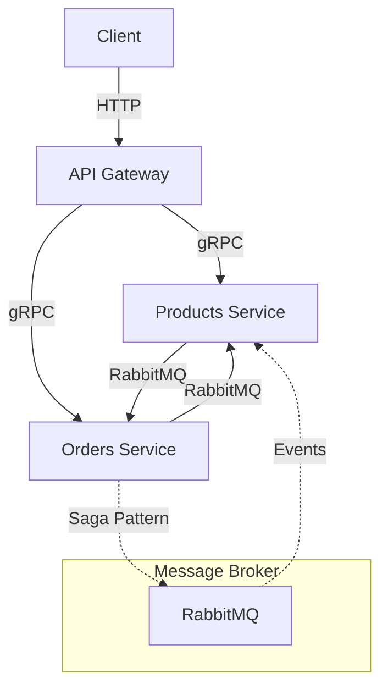
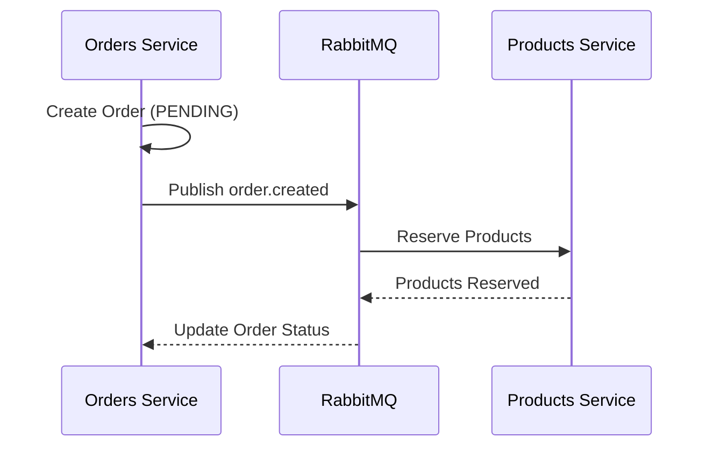
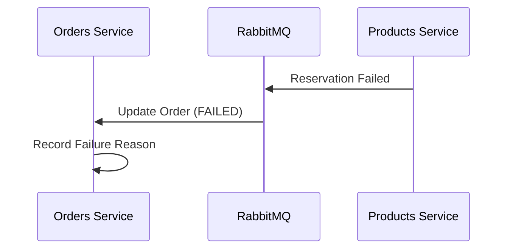

# Microservices Architecture Documentation

## System Overview

This project implements a microservices architecture using both gRPC for synchronous communication and RabbitMQ for asynchronous event-driven communication. The system consists of three main components:

1. API Gateway
2. Products Microservice
3. Orders Microservice



## Components

### 1. API Gateway
- **Port**: 3000
- **Role**: Entry point for all client requests
- **Technologies**: NestJS, gRPC clients
- **Responsibilities**:
  - Route HTTP requests to appropriate microservices
  - Protocol translation (HTTP → gRPC)
  - Request/Response transformation
  - Service aggregation

### 2. Products Microservice
- **Port**: 5000
- **Role**: Product management and inventory
- **Technologies**: 
  - NestJS
  - MongoDB
  - gRPC server
  - RabbitMQ client
- **Responsibilities**:
  - Product CRUD operations
  - Inventory management
  - Product validation
  - Product reservation handling
  - Stock management in distributed transactions

### 3. Orders Microservice
- **Port**: 5001
- **Role**: Order management
- **Technologies**: 
  - NestJS
  - PostgreSQL (TypeORM)
  - gRPC server
  - RabbitMQ client
- **Responsibilities**:
  - Order CRUD operations
  - Order status management
  - Order validation
  - Orchestrating the order saga pattern

## Communication Patterns

### 1. Synchronous Communication (gRPC)
Used for direct request-response patterns:
```
Client → API Gateway (HTTP) → Microservices (gRPC)
```

### 2. Asynchronous Communication (RabbitMQ)
Used for event-driven communication and saga pattern:
- Exchange: 'products_exchange'
- Queues:
  - 'product_reservation_queue'
- Routing Keys:
  - 'order.created'
  - 'order.cancelled'

### 3. Saga Pattern Implementation
The system implements a choreography-based saga pattern for order processing:

1. Order Creation Saga:


2. Order Failure Handling:


## Data Models

### Product
```typescript
interface Product {
  id: string;
  name: string;
  description: string;
  price: number;
  quantity: number;
  category: string;
  isActive: boolean;
}
```

### Order
```typescript
enum OrderStatus {
  PENDING,
  PRODUCT_RESERVED,
  CONFIRMED,
  FAILED,
  COMPLETED,
  CANCELLED
}

interface Order {
  id: string;
  userId: string;
  items: OrderItem[];
  total: number;
  status: OrderStatus;
  failureReason?: string;
  createdAt: Date;
  updatedAt: Date;
}

interface OrderItem {
  productId: string;
  quantity: number;
}
```

## Message Broker Configuration

RabbitMQ is configured for:
1. Reliable message delivery
2. Message persistence
3. Dead letter queues
4. Message acknowledgments

## Error Handling

1. gRPC Status Codes for synchronous communication
2. Dead Letter Queues for failed async messages
3. Saga compensation actions for distributed transactions
4. Consistent error format for client responses

## Deployment

Services are containerized using Docker:
1. Individual Dockerfile for each service
2. Docker Compose for local development
3. Independent scaling capabilities
4. Shared RabbitMQ instance

## Monitoring & Observability

Current implementation includes:
1. Service logs
2. RabbitMQ management interface
3. Basic health checks

## Future Improvements

1. Implement service discovery
2. Add circuit breakers
3. Implement distributed tracing
4. Add metrics and monitoring
5. Implement caching layer
6. Add authentication/authorization
7. Add retry policies for failed messages
8. Implement dead letter queue processing
9. Add monitoring for saga transactions
