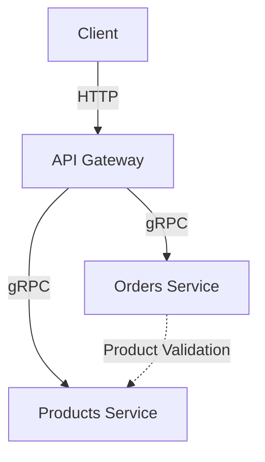

# Microservices Architecture Documentation

## System Overview

This project implements a microservices architecture using gRPC for inter-service communication. The system consists of three main components:

1. API Gateway
2. Products Microservice
3. Orders Microservice



## Components

### 1. API Gateway
- **Port**: 3000
- **Role**: Entry point for all client requests
- **Technologies**: NestJS, gRPC clients
- **Responsibilities**:
  - Route HTTP requests to appropriate microservices
  - Protocol translation (HTTP → gRPC)
  - Request/Response transformation
  - Service aggregation

### 2. Products Microservice
- **Port**: 5000
- **Role**: Product management and inventory
- **Technologies**: NestJS, MongoDB, gRPC server
- **Responsibilities**:
  - Product CRUD operations
  - Inventory management
  - Product validation

### 3. Orders Microservice
- **Port**: 5001
- **Role**: Order management
- **Technologies**: NestJS, PostgreSQL (TypeORM), gRPC server
- **Responsibilities**:
  - Order CRUD operations
  - Order status management
  - Order validation

## Communication Flows

### 1. Product Management Flow
```
Client → API Gateway (HTTP) → Products Service (gRPC)
POST /products → CreateProduct
GET /products → FindAll
GET /products/:id → FindOne
PUT /products/:id → Update
DELETE /products/:id → Remove
```

### 2. Order Management Flow
```
Client → API Gateway (HTTP) → Orders Service (gRPC)
POST /orders → CreateOrder
GET /orders → FindAll
GET /orders/:id → FindOne
PUT /orders/:id/status → UpdateStatus
DELETE /orders/:id → Remove
```

### 3. Order-Product Chain Communication
When creating or updating an order:
1. Client sends order request to API Gateway
2. Orders service receives the request
3. Orders service validates product availability through Products service
4. Order status is updated based on product availability

## Data Models

### Product
```typescript
interface Product {
  id: string;
  name: string;
  description: string;
  price: number;
  quantity: number;
  category: string;
  isActive: boolean;
}
```

### Order
```typescript
enum OrderStatus {
  PENDING,
  PRODUCT_RESERVED,
  CONFIRMED,
  FAILED,
  COMPLETED,
  CANCELLED
}

interface Order {
  id: string;
  userId: string;
  items: OrderItem[];
  total: number;
  status: OrderStatus;
  failureReason?: string;
  createdAt: Date;
  updatedAt: Date;
}
```

## Service Discovery & Load Balancing

Currently, services use static configuration for communication:
- Products Service: `localhost:5000`
- Orders Service: `localhost:5001`

For production, implement:
- Service registry (e.g., Consul, Eureka)
- Load balancer
- Dynamic service discovery

## Deployment

Each service can be deployed independently:
1. Each has its own Dockerfile
2. Separate deployment pipelines
3. Independent scaling capabilities

## Error Handling

1. gRPC Status Codes used for error communication
2. Error propagation through API Gateway
3. Consistent error format for client responses

## Future Improvements

1. Implement service discovery
2. Add circuit breakers
3. Implement distributed tracing
4. Add metrics and monitoring
5. Implement caching layer
6. Add authentication/authorization
7. Implement event-driven communication for specific scenarios
